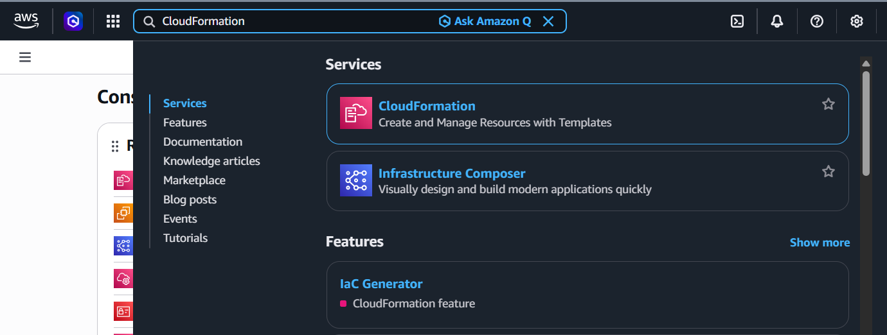
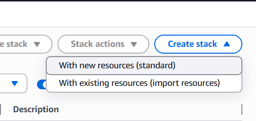
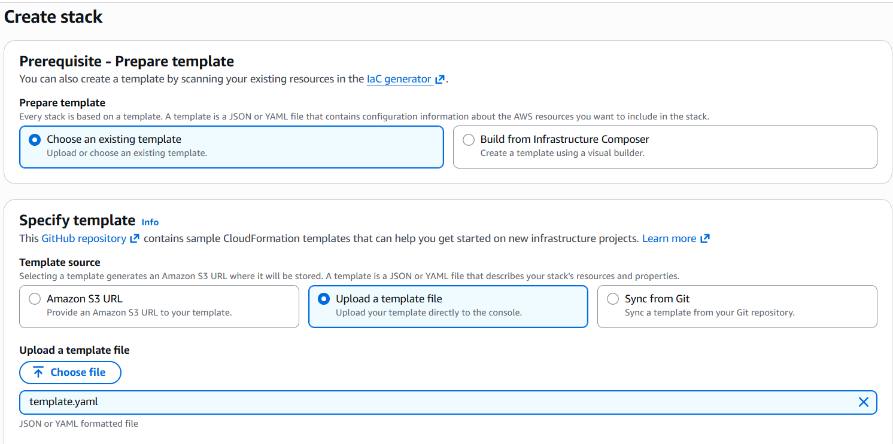
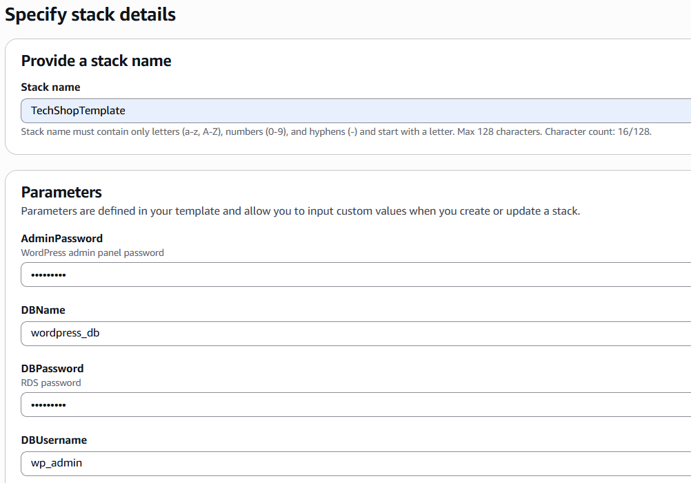
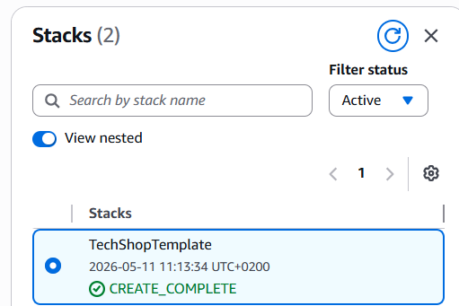
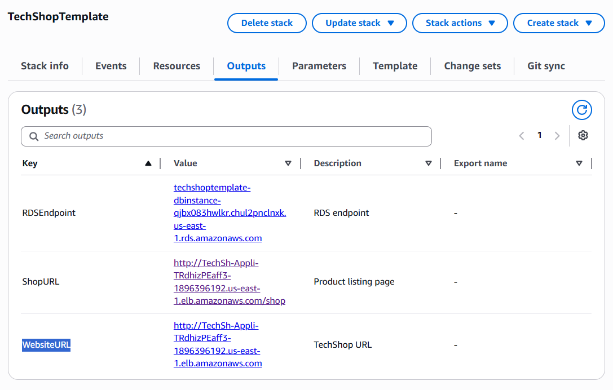
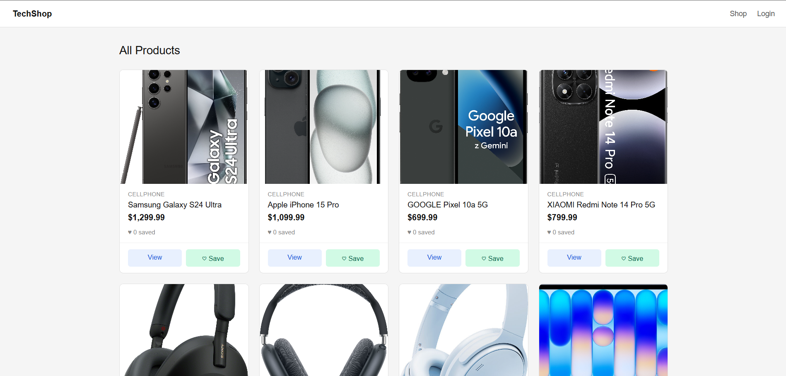

# TechShop

Projekt sklepu internetowego opartego na WordPressie, wdrożonego na AWS przy użyciu CloudFormation.
Stworzony w celu zademonstrowania skalowalnej, wielostrefowej architektury chmurowej z Auto Scaling Group, Application Load Balancer, RDS i EFS.

---

## Wdrożenie
 
### Wymagania wstępne
- Konto AWS z uprawnieniami do CloudFormation, EC2, RDS, EFS i ELB

---

### Instrukcja krok po kroku
 
**1. Otwórz CloudFormation**
 
W pasku wyszukiwania AWS wpisz `CloudFormation` i wybierz usługę.

---

**2. Utwórz nowy stos**
 
Kliknij **Create stack** → **With new resources (standard)**.
 

---

**3. Prześlij szablon**
 
Wybierz **Upload a template file**, wskaż plik `cloudformation/template.yml` z tego projektu, a następnie kliknij **Next**.
 

---

**4. Wprowadź nazwę stosu i parametry**
 
Ustaw nazwę stosu — propozycja: `TechShopTemplate`.
 
Uzupełnij hasła dla `DBPassword` i `AdminPassword`. Pozostałe wartości możesz zostawić domyślne.
 
Kliknij **Next**.
 

---

**5. Przejdź przez kolejne opcje**
 
Kliknij **Next** → **Next** → **Submit**.
 
Poczekaj, aż stos osiągnie status `CREATE_COMPLETE`. Proces ten trwa około 15–20 minut.
 

---

**6. Otwórz sklep**
 
Wróć do CloudFormation, wybierz swój stos i otwórz zakładkę **Outputs**.
Znajdź wartość `WebsiteURL`, kliknij link lub wklej go w nowej karcie przeglądarki.
 

 
Sklep załaduje się automatycznie pod adresem `/shop`.

---

## Strony
 
| Adres URL | Opis |
|---|---|
| `/shop` | Lista produktów, możliwość zapisywania do ulubionych |
| `/product?product_id=N` | Szczegóły pojedynczego produktu |
| `/favorites` | Zapisane produkty (wymagane logowanie) |
| `/login` | Logowanie i rejestracja |

---

## Dostęp administratora
 
Panel administracyjny WordPress dostępny jest pod adresem `/wp-login.php`.
Zaloguj się jako `admin` używając hasła `AdminPassword` podanego podczas wdrożenia.
 
> Zwykli zarejestrowani użytkownicy są automatycznie blokowani przed dostępem do `/wp-admin`.
 
---
 
## Uwagi
 
- Zdjęcia produktów są ładowane bezpośrednio z zewnętrznych adresów URL (MediaExpert).
- Przycisk `Buy Now` na stronie ulubionych jest celowo wyłączony — proces zakupowy wykracza poza zakres tego projektu studyjnego.